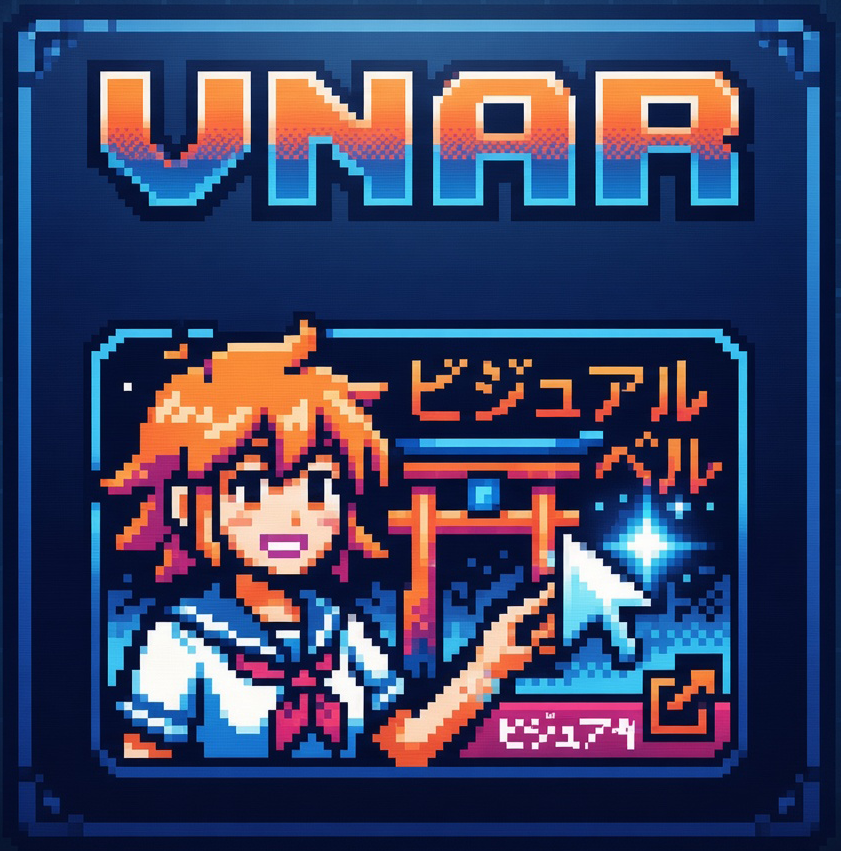

<div align="center">
  

# VNAR

**Tu biblioteca de visual novels, sin dolores de cabeza por el locale.**

Un launcher ligero para Windows enfocado en visual novels, con integración con Locale Emulator, metadatos de VNDB, edición de portadas, navegación por desarrolladores, favoritos, soporte WebP y accesos directos inteligentes.

[English](README.md) · [Descargar Beta 1.2](https://github.com/JAVCIF/vnar/releases/tag/v1.0.0-beta.1.2)
</div>

## Descargas

> **Windows 10/11 x64**

| Paquete | Descripción | Descarga |
| --- | --- | --- |
| Instalador | Instalación autocontenida, acceso en el menú Inicio y acceso de escritorio opcional | [VNAR-Setup.exe](https://github.com/JAVCIF/vnar/releases/download/v1.0.0-beta.1.2/VNAR-Setup.exe) |
| Portable | Versión autocontenida; descomprime y ejecuta `VNAR.exe` | [VNAR-Portable-win-x64.zip](https://github.com/JAVCIF/vnar/releases/download/v1.0.0-beta.1.2/VNAR-Portable-win-x64.zip) |

Locale Emulator **no viene incluido** dentro de VNAR. En el primer arranque puedes seleccionar un `LEProc.exe` existente o dejar que VNAR descargue la versión oficial de Locale Emulator.

El portable no requiere instalación, pero ambas versiones guardan ajustes, biblioteca y portadas en `%LOCALAPPDATA%\VNAR`. Respalda esa carpeta para conservar tus datos. Los ejecutables todavía no tienen firma digital, por lo que Windows puede mostrar un aviso de SmartScreen. La release incluye `SHA256SUMS.txt` para comprobar la integridad de las descargas.

## ¿Qué es VNAR?

VNAR es un launcher para Windows pensado para visual novels y otros juegos dependientes de configuración regional. Organiza la biblioteca y ejecuta cada juego mediante Locale Emulator sin necesidad de cambiar el locale global de Windows.

Cada juego puede conservar su ejecutable, argumentos, preferencia de administrador, metadatos de VNDB, portada, estado de favorito y configuración utilizada por sus accesos directos.

## Funciones principales

- **Integración con Locale Emulator** usando los perfiles reales `Run in Japanese` y `Run in Japanese (Admin)`.
- **Configuración inicial de Locale Emulator**, incluyendo descarga y extracción opcional de la versión oficial.
- **Drag & drop de EXE y carpetas**, importación individual y escaneo recursivo de bibliotecas.
- **Integración con VNDB** para títulos, portadas y desarrolladores.
- **Pestaña Developers** que agrupa los juegos configurados por desarrollador.
- **Favoritos** con pestaña propia y estrella rápida en cada tarjeta.
- **Paginación configurable** entre 10 y 50 elementos por página.
- **Interfaz en inglés y español**, detectando el idioma inicial de Windows (español para `es-*`, inglés para cualquier otro idioma).
- **Editor no destructivo de portadas** con zoom, posición, fondo negro/blanco/transparente/desenfocado y exportación HQ.
- **Compatibilidad WebP** mediante normalización con SkiaSharp.
- **Arrastrar imágenes desde el navegador** para juegos y desarrolladores.
- **Creación de accesos directos** con iconos seleccionables extraídos de los ejecutables de la carpeta del juego.
- **Accesos directos inteligentes** basados en el ID interno del juego para respetar cambios posteriores de admin, argumentos o perfiles de Locale Emulator.
- **Doble clic para jugar** y menú contextual desde la biblioteca.
- **Interfaz oscura VNAR**, incluyendo controles y barras de desplazamiento tematizadas.
- **Sin servicios en segundo plano.**

## Inicio rápido

1. Descarga el instalador o la versión portable.
2. Abre VNAR.
3. En el primer arranque selecciona tu `LEProc.exe` o usa **Descargar / configurar LE**.
4. Añade un ejecutable, arrastra una carpeta o escanea tu biblioteca.
5. Configura el juego y, si quieres, añade su ID de VNDB.
6. Haz doble clic en la portada o pulsa **Jugar**.

## Locale Emulator

VNAR utiliza [Locale Emulator](https://github.com/xupefei/Locale-Emulator) como aplicación externa. Lee sus perfiles configurados y ejecuta los juegos mediante `LEProc.exe -runas <guid-del-perfil>`.

VNAR no modifica los ejecutables de los juegos y no necesita cambiar el locale global de Windows.

## VNDB y búsqueda de portadas

VNDB se utiliza para metadatos, portadas y asociaciones con desarrolladores. Los resultados internos de Google Images son opcionales y requieren una API key propia de SerpApi. VNDB y el drag & drop desde navegador funcionan sin SerpApi.

## Compilar desde código fuente

Necesitas:

- Windows 10/11
- [.NET 10 SDK](https://dotnet.microsoft.com/download/dotnet/10.0)

```powershell
dotnet restore .\LocaleGameHub\LocaleGameHub.csproj
dotnet run --project .\LocaleGameHub\LocaleGameHub.csproj
```

También se incluyen `build_portable.bat` y `build_small.bat` para compilaciones locales.

## Iconos de la barra de tareas (Beta 1.2)

VNAR ahora declara su propio AppUserModelID de Windows. Cada acceso de juego tiene
una identidad distinta y estable para que su icono no se asocie a la ventana del
launcher. La opción de administrador sigue cambiando únicamente el perfil de
Locale Emulator.

Los accesos antiguos siguen funcionando. Vuelve a crearlos desde VNAR para añadir
la nueva identidad. Si Windows conserva el icono de un VNAR anclado anteriormente,
desancla ese acceso, abre el `VNAR.exe` actualizado y ancla la ventana nueva.
No necesitas borrar la caché global de iconos ni tus datos.

## Estado del proyecto

Versión pública actual: **Beta 1.2 (`1.0.0-beta.1.2`)**.

Puedes usar GitHub Issues para reportar errores o proponer mejoras.

## Licencia

El código fuente de VNAR se distribuye bajo la [Licencia MIT](LICENSE).

Las dependencias y servicios externos conservan sus propias licencias y términos. Consulta [THIRD_PARTY_NOTICES.md](THIRD_PARTY_NOTICES.md).

## Aviso

VNAR no está afiliado con Locale Emulator, VNDB, SerpApi ni con los desarrolladores o publishers de visual novels. Las portadas, iconos de ejecutables y demás recursos importados por el usuario pertenecen a sus respectivos titulares.
